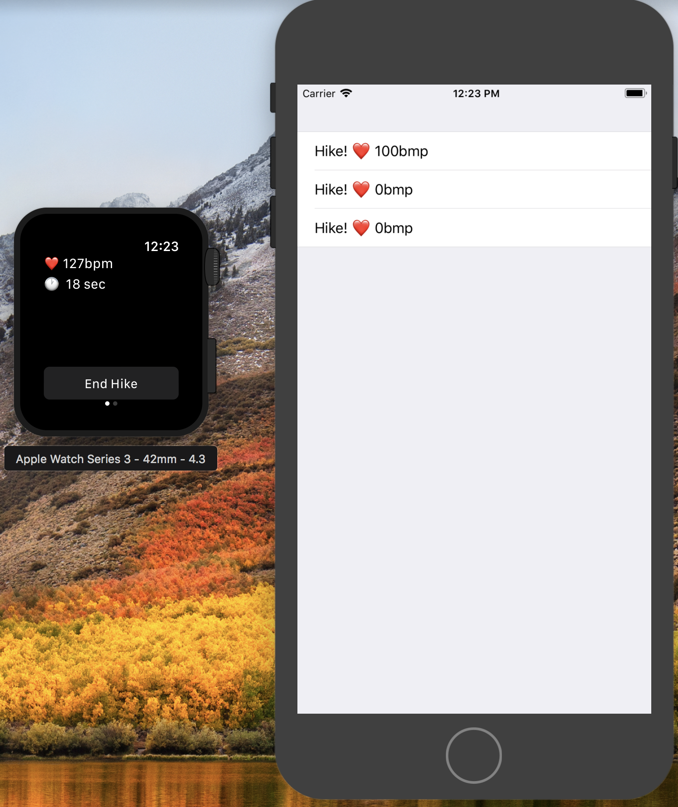
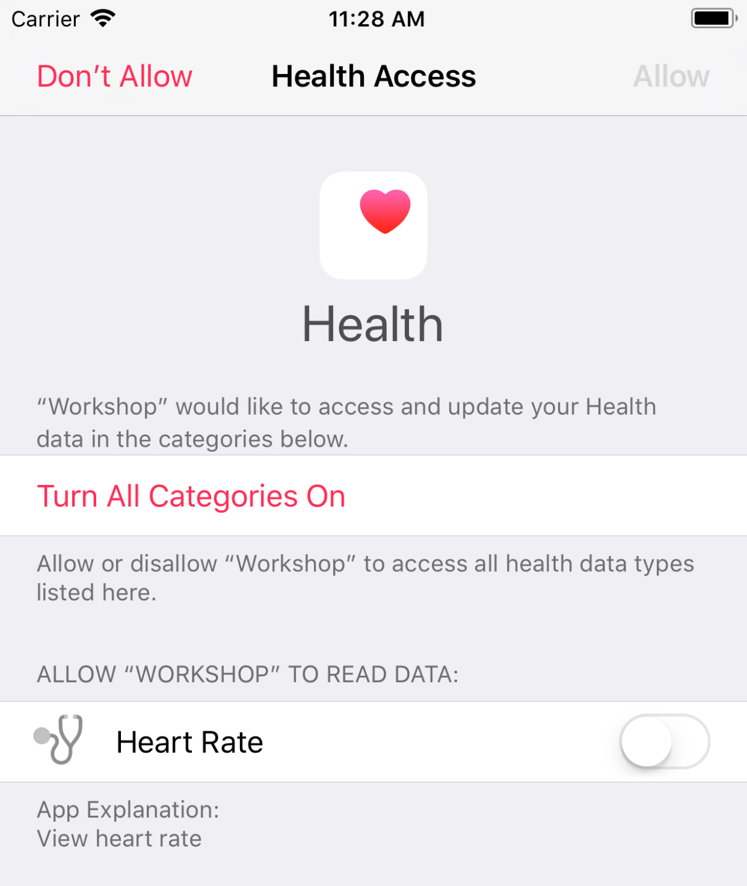
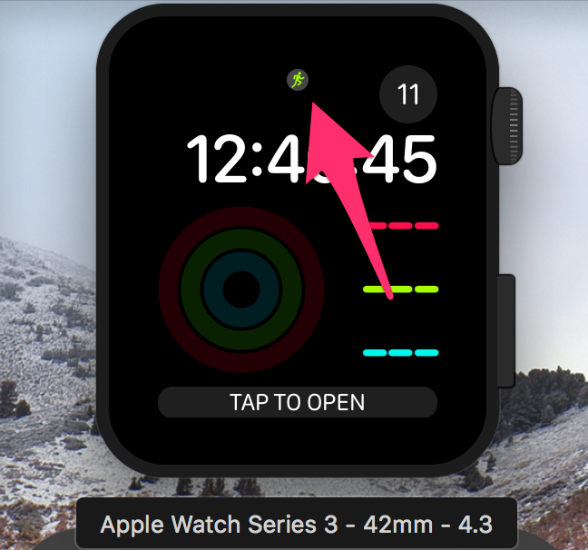

theme: Business Class
text: PT Serif
footer: 
slidenumbers: true
header: Roboto-Medium

# Apple Watch Workshop

---

# Why Apple Watch?

* Relatively new platform (opportunity!)
* Many customers (estimated 33MM sold)
* Easy to design for non-designers 😉

---

# App Examples

---


---


---

# What we'll build

A hiking app!  The watch's size and senors make it a good fit for fitness related functions.  Also, in workout mode your app can run in the background.



---

# What we'll learn

1. Sending data to the watch and back
2. Code sharing between targets
3. Heart rate monitoring using Healthkit

---

# Demo: Build the UI

---

# Watch Connectivity

---

# WCSession

* Single instance for the entire application.
* Manages all communication between watch and phone.
* Must be activated before use.

```swift
if WCSession.isSupported() {
    let session = WCSession.defaultSession()
    session.delegate = self
    session.activateSession()
}
```

---

# Application Context

Allows you to maintain a single dictionary for state of the watch and phone.

```swift
WCSession.default.updateApplicationContext([
    "loggedIn": true,
    "username": "test@test.com"
])
```

---

# Sending Messages

* Realtime messaging

```swift
sendMessage(_ message: [String : Any])
sendMessageData(_ data: Data)
```

* Semi-realtime with delivery guarantees

```swift
transferUserInfo(_ userInfo: [String : Any])
```

---

# Keep in mind...

1. WCSession.isSupported()
2. session.activationState == .activated
3. session.isPaired
4. session.isWatchAppInstalled
5. session.isReachable

[.build-lists: true]

---

# Error states

```
case genericError
An error indicating that some unknown problem occurred.

case sessionNotSupported
An error indicating that the current device does not support the use of session objects.

case sessionMissingDelegate
An error indicating that the WatchKit extension does not have a valid extension delegate to process events.

case sessionNotActivated
An error indicating that the other device has not yet activated its session.

case deviceNotPaired
An error indicating that the current device is not paired with a counterpart device. Communication can happen only between paired devices.

case watchAppNotInstalled
An error indicating that the Watch app is not installed on the user’s Apple Watch.

case notReachable
An error indicating that the counterpart app is not currently reachable. This error occurs when you send an immediate message to an app that is not running.

case invalidParameter
An error indicating that a parameter was invalid.

case payloadTooLarge
An error indicating that the item being sent exceeds the maximum size limit. This type of error can occur for both data dictionaries and files.

case payloadUnsupportedTypes
An error indicating that a dictionary contains non property-list types.

case messageReplyFailed
An error indicating that the reply could not be returned.

case messageReplyTimedOut
An error indicating that the counterpart app did not return a reply in time.

case fileAccessDenied
An error indicating that a file could not be transferred because it was inaccessible. This error can occur when the file path is invalid or the app has insufficient privileges to access the file.

case deliveryFailed
An error indicating that the payload could not be delivered.

case insufficientSpace
An error indicating that there is not enough space on the receiving side to store the data being sent.

case sessionInactive
An error indicating that the session is inactive. This error occurs when you try to send data using an inactive session.

case transferTimedOut
An error indicating that the timeout value was reached before the transfer completed.
```

[WCError Documentation](https://developer.apple.com/documentation/watchconnectivity/wcerror.code)

---

# WatchSync [Github](https://github.com/nickromano/WatchSync)

* Use typed messages
* Subscribe to particular message types
* If a realtime message fails, automatically send in background
* Message delivered notification
* GZip message (10x smaller to get around size restrictions)

---

# Example: WatchConnectivity - Send Message

```swift
if !WCSession.isSupported() {
    return
}
let message: [String: Any] = [
    "messageType": "CompletedHike",
    "startTime": Date(),
    "endDate": Date(),
    "totalCalories": 100
]
let session = WCSession.default
if session.activationState == .activated &&
	session.isPaired &&
	session.isWatchAppInstalled && 
	session.isReachable {
    WCSession.default.sendMessage(message, replyHandler: nil) { error in
        print(error.localizedDescription)
    }
}
```
---

# Example: WatchConnectivity - Receive Message

```swift
extension AppDelegate: WCSessionDelegate {
    func session(_ session: WCSession, didReceiveMessage message: [String : Any]) {
        let messageType = message["messageType"] as? String
        if messageType == "CompletedHike" {
            guard let startTime = message["startTime"] as? Date else {
                print("Missing start time")
                return
            }
            guard let endTime = message["endTime"] as? Date else {
                print("Missing end time")
                return
            }
            guard let totalCalories = message["totalCalories"] as? Int else {
                print("Missing total calories")
                return
            }

            print(startTime, endTime, totalCalories)
            // Send information to view controller
        }
    }
}
```

---

# Example: WatchSync - Define Message Type

```swift
struct CompletedHikeMessage: SyncableMessage {
    let startTime: Date
    let endTime: Date
    let totalCalories: Int
}
```

---

# Example: WatchSync - Send Message

```swift
let message = CompletedHikeMessage(
	startTime: Date(),
	endTime: Date(),
	totalCalories: 100
)

WatchSync.shared.sendMessage(message) { result in
    switch result {
    case .failure(_):
        break
    case .sent:
        break
    case .delivered:
        break
    }
}
```

---

# Example: WatchSync - Receive Message

```swift
class ViewController: UIViewController {
    var token: SubscriptionToken?

    override func viewDidLoad() {
        token = WatchSync.shared.subscribeToMessages(ofType: CompletedHikeMessage.self) { message in
            print(message.startTime, message.endTime, message.totalCalories)
        }
    }
}
```

---

# Demo: Send Messages

---

# Healthkit - [Docs](https://developer.apple.com/documentation/healthkit)

* Enable capability (links framework, adds entitlement)
* Check availability

```swift
HKHealthStore.isHealthDataAvailable()
```

* Request granular permissions (right)
* Query!



---

# Healthkit Workout

Starting a working using healtkit has a few benefits:

* Keeps your app running the background.
* Adds a button the watch face to quickly jump to your app.
* Stores your apps workout data in the Activity app as well.



---

# Demo: Healthkit

---

# Production apps

* Performance - use background threads for everything that can be run off the main thread.
* Navigation/view hierarchy - Choose either page based or list / detail view upfront!
* Focus on building quick interactions instead of full apps.

---

# Progressive enhancement

Develop for lowest common denominator and build up

* Watch Series 1 - Heart rate
* Watch Series 2 - Heart rate, GPS
* Watch Series 3 - Heart rate, GPS, Cellular & Altimiter

---

# More resources

* [Human Interface Guidelines](https://developer.apple.com/watchos/human-interface-guidelines/overview/themes/) for the Apple Watch
* [WatchConnectivity](https://developer.apple.com/documentation/watchconnectivity)
* [HealthKit](https://developer.apple.com/documentation/healthkit)
* [Natasha the Robot's Blog](https://www.natashatherobot.com/)
